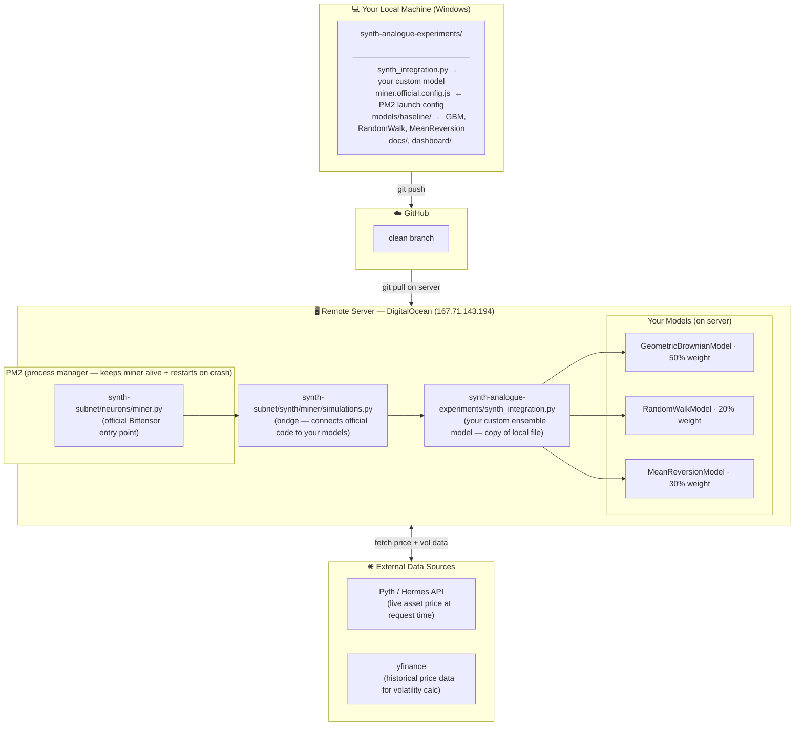
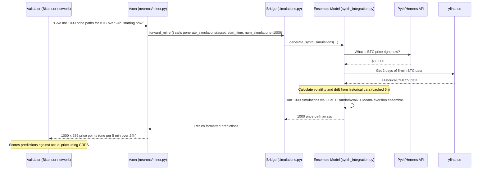

# Miner Architecture

This document explains how the Synth subnet miner works — where the models live, how requests are received, and how predictions are generated and returned.

## Overview

The miner is a node on the [Bittensor](https://bittensor.com/) network, specifically on **Subnet 50 (Synth)**. It earns TAO rewards by submitting accurate price forecast distributions for crypto assets (BTC, ETH, SOL, XAU) to validators. Validators score predictions using [CRPS](https://en.wikipedia.org/wiki/Continuous_ranked_probability_score) — the closer your distribution is to the actual price, the higher your score and reward.

---

## Architecture: Where Everything Lives



---

## Request Flow: Step by Step

This is what happens every time a validator asks for predictions:



---

## The Two Layers

Think of the miner as two separate layers working together:

**Layer 1 — Official Bittensor plumbing** (`synth-subnet/`, managed by the Synth team)
- Handles network registration, wallet auth, axon serving, and validator communication
- Entry point: `synth-subnet/neurons/miner.py`
- You do not modify this — keep it up to date via `git pull` inside `synth-subnet/`

**Layer 2 — Your custom prediction engine** (`synth-analogue-experiments/`, managed by you)
- `synth_integration.py` — the ensemble model that generates the actual price forecasts
- `models/baseline/` — the three individual models it combines
- The bridge (`synth-subnet/synth/miner/simulations.py`) was modified once to import and call your code instead of the default model

---

## The Ensemble Model

Your custom model (`EnsembleGBMWeightedModel`) combines three price simulation approaches:

| Model | Weight | Description |
|---|---|---|
| `GeometricBrownianModel` | 50% | Standard financial model — drift + random volatility |
| `MeanReversionModel` | 30% | Assumes price pulls back toward a mean over time |
| `RandomWalkModel` | 20% | Pure random walk — simple baseline |

Each model is calibrated every 6 hours using live volatility data from `yfinance` (2 days of 5-minute OHLCV data per asset). The live start price is fetched from the Pyth/Hermes API at the moment of each request.

---

## Key Files Reference

| File | Location | Purpose |
|---|---|---|
| `miner.official.config.js` | repo root | PM2 config — defines how to start the miner (interpreter, wallet, port) |
| `synth_integration.py` | repo root | Your custom ensemble model + `generate_synth_simulations()` entry point |
| `models/baseline/geometric_brownian.py` | `models/baseline/` | GBM price simulation model |
| `models/baseline/mean_reversion.py` | `models/baseline/` | Mean reversion price simulation model |
| `models/baseline/random_walk.py` | `models/baseline/` | Random walk price simulation model |
| `models/baseline/volatility_calculator.py` | `models/baseline/` | Fetches volatility + drift from yfinance |
| `neurons/miner.py` | `synth-subnet/` | Official miner entry point — do not modify |
| `synth/miner/simulations.py` | `synth-subnet/` | **Bridge file** — modified once to import your model |

---

## Deployment Workflow (Updating the Miner)

```
1. Edit code locally (e.g. improve a model in models/baseline/)
2. git commit + git push origin clean
3. SSH into server: ssh root@167.71.143.194
4. cd /root/synth-analogue-experiments && git pull origin clean
5. pm2 restart synth-miner
6. pm2 logs synth-miner  ← verify it started cleanly
```

See [DEPLOYMENT_GUIDE.md](DEPLOYMENT_GUIDE.md) for the full safe-update procedure.

---

## Server Details

| Property | Value |
|---|---|
| Provider | DigitalOcean |
| IP | 167.71.143.194 |
| Hostname | synth-miner-robust |
| OS | Ubuntu 22.04 LTS |
| Python | 3.11 (`/usr/bin/python3.11`) |
| PM2 version | 6.0.13 |
| Wallet name | wallet1 |
| Hotkey | default |
| Subnet | 50 (Synth) |
| UID | 233 |
| Axon port | 8091 |
